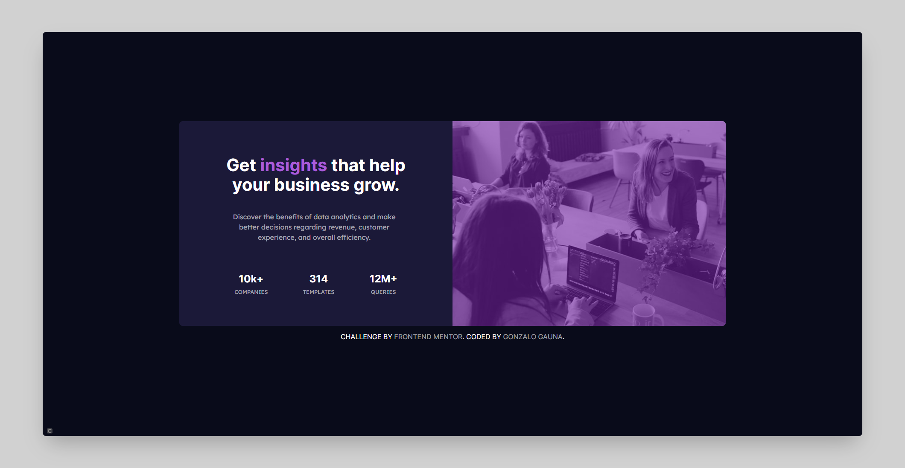

# Frontend Mentor - Stats preview card component solution

This is a solution to the [Stats preview card component challenge on Frontend Mentor](https://www.frontendmentor.io/challenges/stats-preview-card-component-8JqbgoU62). Frontend Mentor challenges help you improve your coding skills by building realistic projects. 

## Table of contents

- [Overview](#overview)
  - [The challenge](#the-challenge)
  - [Screenshot](#screenshot)
  - [Links](#links)
- [My process](#my-process)
  - [Built with](#built-with)
  - [Useful resources](#useful-resources)
- [Author](#author)

## Overview

### The challenge

Users should be able to:

- View the optimal layout depending on their device's screen size

### Screenshot

### Links

- Solution URL: [Frontend Mentor](https://www.frontendmentor.io/challenges/stats-preview-card-component-8JqbgoU62)
- Live Site URL: [Netlify Host](https://gonzalo-gauna-card-practice1.netlify.app/)

## My process

### Built with

- Semantic HTML5 markup
- CSS custom properties
- Flexbox
- CSS Grid

### Useful resources

- [A Complete Guide to Flexbox - CSS-TRICKS](https://css-tricks.com/snippets/css/a-guide-to-flexbox/) - This helped me reinforce concepts of Flexbox.
- [A Complete Guide to Grid - CSS-TRICKS](https://css-tricks.com/snippets/css/complete-guide-grid/) - This helped me reinforce concepts of Grid.

## Author

- Frontend Mentor - [@GonzaloGauna](https://www.frontendmentor.io/profile/GonzaloGauna)
- Twitter - [@gonzalogaunaDev](https://www.twitter.com/@gonzalogaunaDev)

